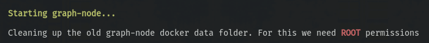

# Colony Dapp

## Prerequisites
* `node` `v14.18.x` (Best use [nvm](https://github.com/nvm-sh/nvm))
* `npm` `v8.x.x`
* `docker` (See [install instructions](https://docs.docker.com/engine/install/))
* `docker-compose` (See [install instructions](https://docs.docker.com/compose/install/))
* `jq` (See [install instructions](https://github.com/stedolan/jq/wiki/Installation))

## Installation

First, clone this repository :)

### Install packages

Pick the right node version (as seen in `.nvmrc`):

```bash
nvm use
```

Install all dependencies:

```bash
npm install
```

### Provision dependent libraries

This project depends on external libraries, so after cloning, they need to be provisioned:
```bash
npm run provision
```

Under the hood, this will initialize the `submodule`s, install their packages, and build them.

### Define environment variables

The provision step will set up a `.env` file for you. It should work right out of the bat. If needed, customize the variables in the `.env` file to your desires.

## Running the _light_ dev environment

```bash
npm run dev
```

This will run a _partial `dev` stack_ which starts `ganache`, deploys the contracts, starts a `mongodb` instance as well as `colonyServer` and `webpack`.

**The webpack dev server will be available under `http://localhost:9090`.**

You can run some of these individually using the following commands:

```
npm run ganache
npm run contracts:deploy
npm run webpack
```

When run individually, some processes might need an own terminal window.

You can also run the whole stack and skip some commands, e.g.:

```bash
npm run dev -- --skip-webpack
```

**NOTE:** You need to pass in the extra `--` as the `--skip-<proces>` argument will get passed to an npm script, which in turn, will get passed along to a node script. Also a thing to keep in mind that if using `yarn`, it is not necessary to specify the extra `--` for the arguments to get passed through.

Then run `webpack` individually, if you like:

```bash
npm run webpack
```

Like this you could restart the `webpack` process in cases of hiccups without restarting the whole stack (that happens!)

## Running the _heavy_ dev environment

This version of the `dev` stack includes all available services that we need for the dApp's development. Besides the ones started by the _light_ dev stack, this mode also adds a `graph-node`, `postgres` instance, `ipfs` node as well as deploying Colony's dev subgraph.

```bash
npm run dev:heavy
```

**This is the _recommended_ mode for day-to-day development.**

As with the _light_ stack, you can pass along a `--skip-<proces>` argument to skip certain processes from spinning up. This is most usefull for debbuging.

**Permissions NOTE:** When starting the `graph-node` process we need to perform some folders cleanup in order to ensure that the node is sync'ed up with the current instance of the chain _(`ganache` in this instance)_.

This requiers **ROOT** permissions since the folder we're removing was generated by `docker-compose` and is owned by `root:root`.

You will get a warning in the `dev` stack orchestration feed when this happens:



**Performance NOTE:** The _heavy_ stack starts up a number of processes which take a toll on your machine. Just be aware of the fact that it may take a while for your stack to start up, as well as the process pausing during orchestration startup to ask you for root access _(see above)_.

It is advisable to start the heavy stack without `webpack` and start that in a separate terminal. This is because if something happens with your frontend which needs restart, you won't have to sit through a stack startup again.

When benchmarking this, the full _heavy_ stack startup time took somewhere around `75` seconds, but this was running it on a pretty beefy machine. A standard development laptop might take more time before it's all ready to go.


### Verbose logging

Set the environment variable `VERBOSE` to `true` to enable verbose mode logging in the browser console.

If you're brave enough to set the `DEBUG` environment variable, you'll get a lot of logging from modules we're using (e.g. IPFS). To disable this, you'll need to unset the environment variable and then run this in the browser console: `localStorage.setItem('debug', undefined);`.


## Additional services

### Reputation

In order for reputation to function within your dev environment, you will need to toggle it on first.

Access the following URL to toggle the reputation monitor auto-mining on or off: `http://127.0.01:3001/reputation/monitor/toggle`

You can also view the status of the reputation monitor using the following URL: `http://127.0.01:3001/reputation/monitor/status`


## Building the bundle locally

If you want to build the bundle locally for inspection, you can do it via:
```bash
npm run webpack:build
````

_Note: It's a straight-up dev build. Just bundled, no code optimizations whatsoever._

## Linting

Linting your code via `eslint` can be done as such:
```bash
npm run lint
```

To lint the project's style sheets you run:
```bash
npm run stylelint
```

## Type checking

Type checking using TypeScript can be accessed using this npm script:
```bash
npm run typecheck

# Or, with file watching (or any other `tsc optional arguments`)
npm run typecheck --watch
```

## Testing

To run unit tests you have the following npm script:

```bash
npm run test
```

Twemoji graphics made by Twitter and other contributors, licensed under CC-BY 4.0: https://creativecommons.org/licenses/by/4.0/
